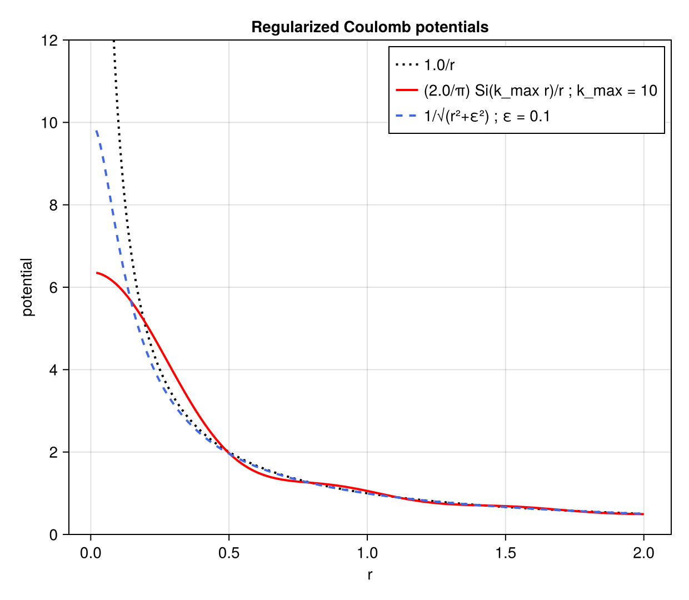
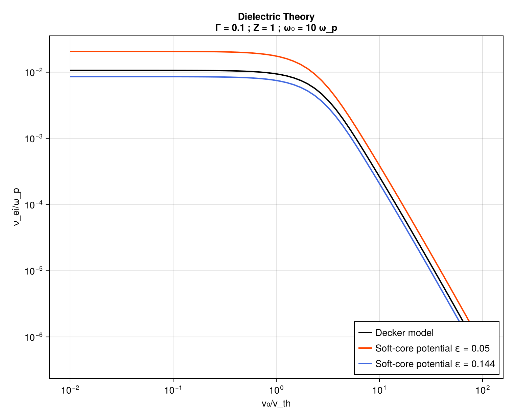
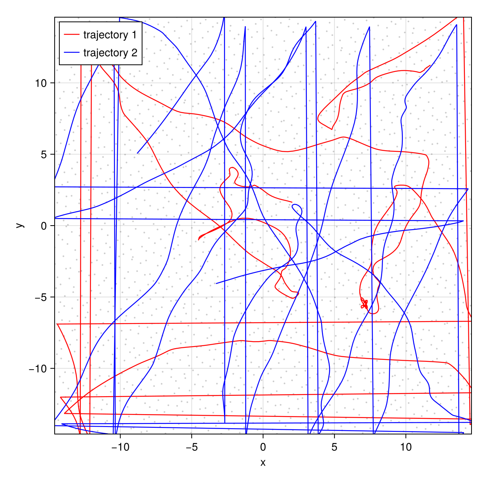
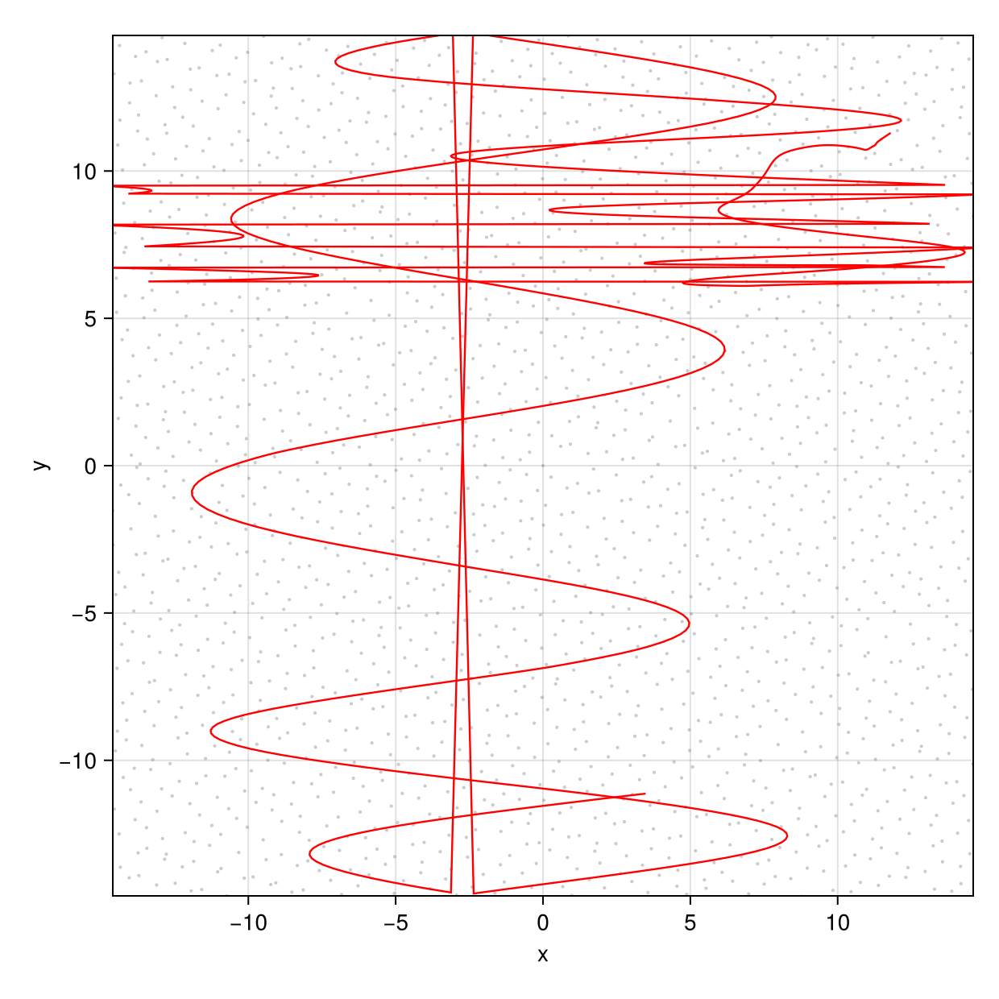
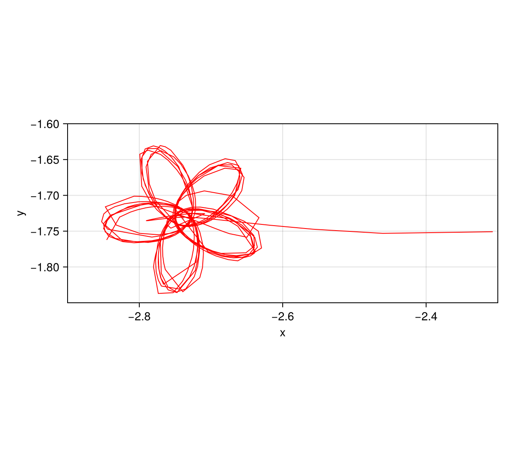
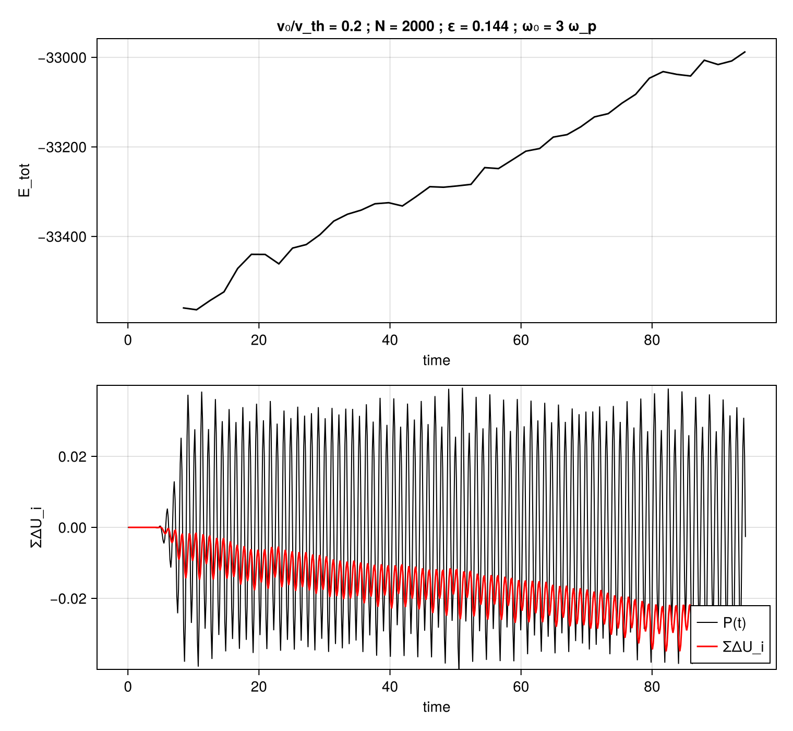
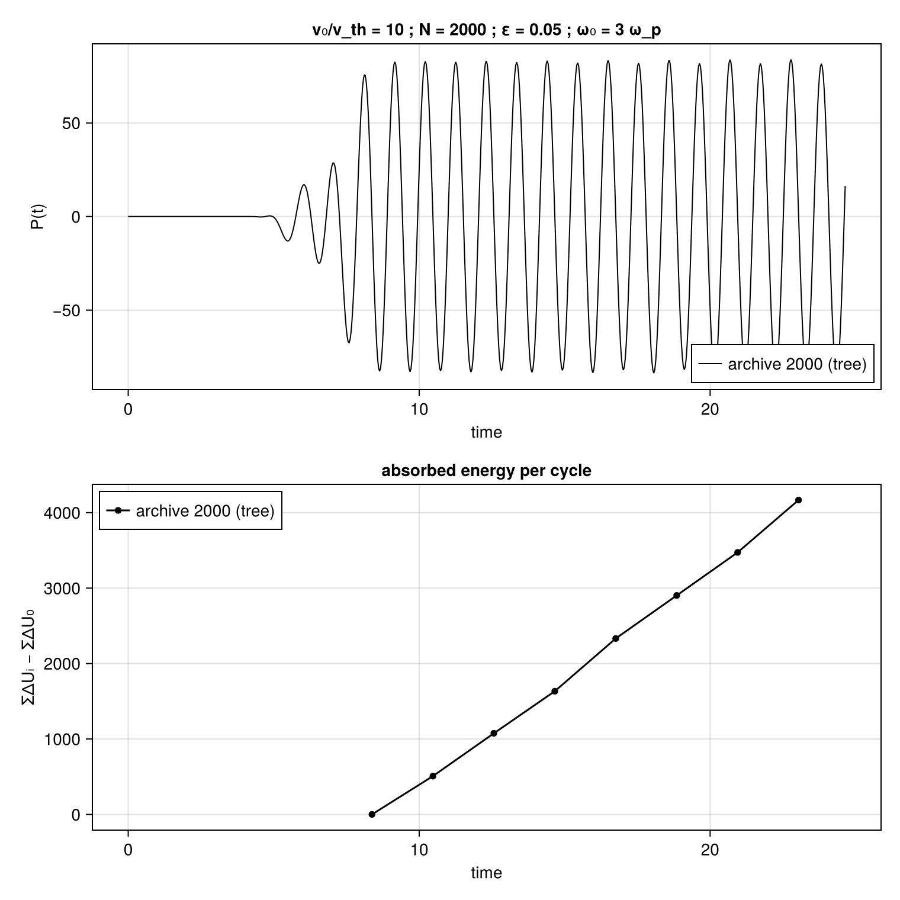
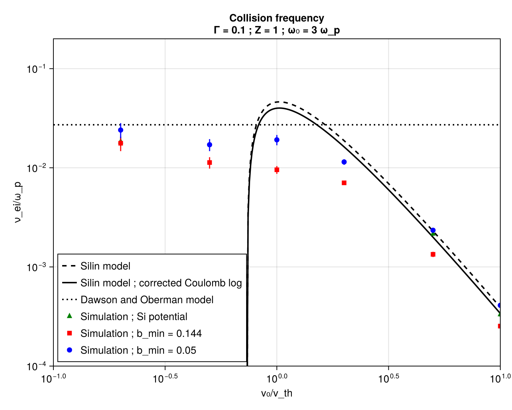
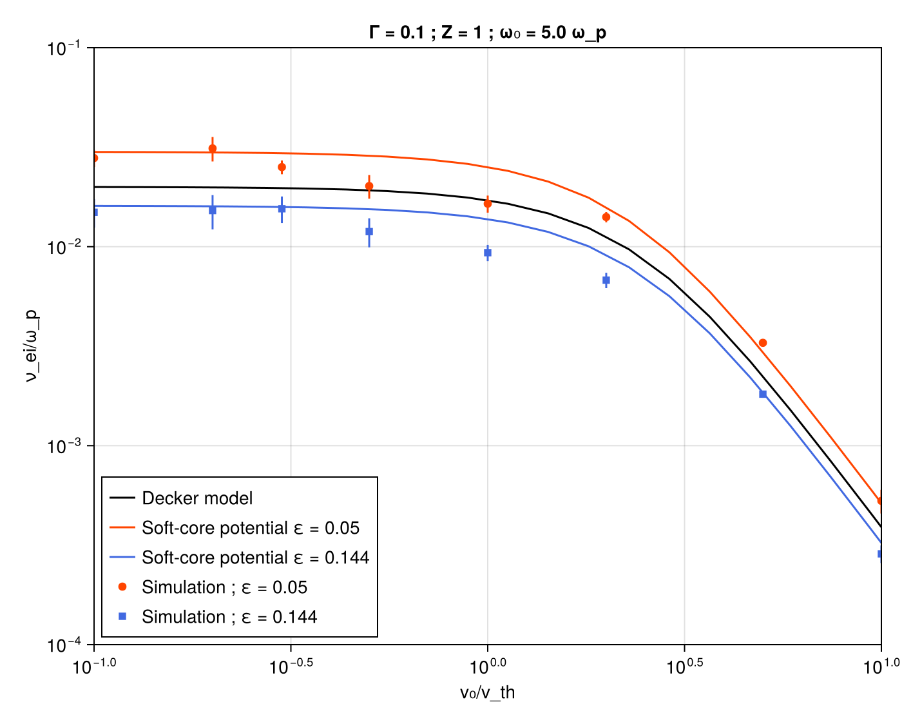
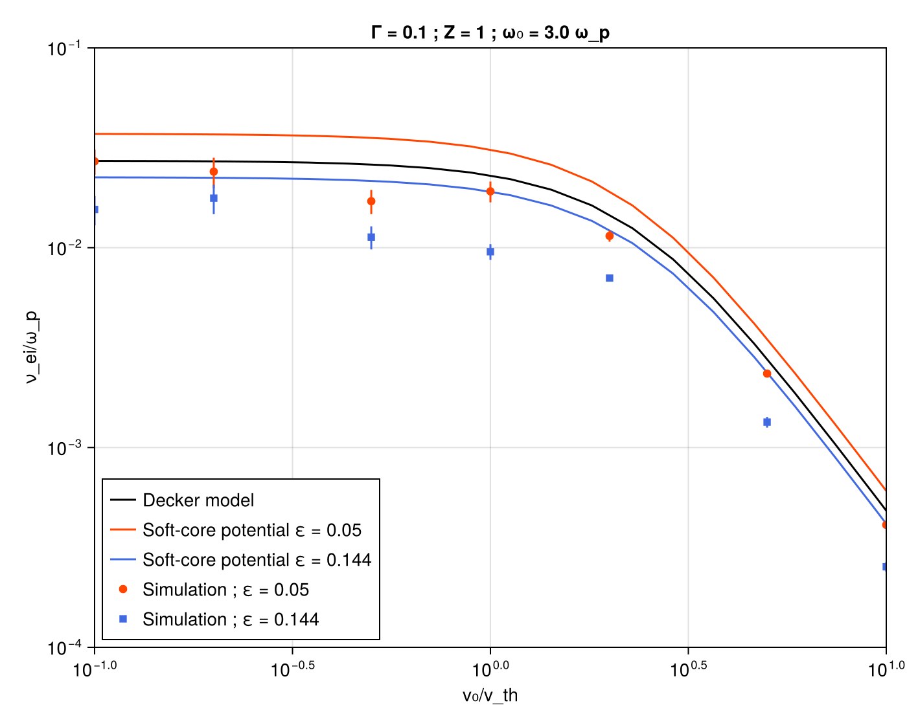

# Figure gallery

The 2000 presentation cites **ten result figures**; all ten are reproduced here. (Two
further archived plots, `indiv` and `indiv2`, are shown on the
[method in pictures](method-illustrations.md) page.)

The point of this page is **provenance**. Each entry says whether the curve was
recomputed by this port or redrawn from archived 2000 output, and which script produces
it. Nothing here is a fit, and nothing is traced by hand.

```sh
julia --project=. figures/build_all.jl     # everything, PNG + PDF
```

Individual scripts run standalone from the repository root. Redrawing archived data does
not rerun a simulation; the bundled files live in `figures/data/`, whose `README.md`
records where each came from. `diel_w10.jl` and `expew.jl` evaluate the dielectric
theory and are the slow ones.

| Figure | Script | Curves | Points |
|---|---|---|---|
| `cutoff` | `figures/cutoff.jl` | recomputed | — |
| `Diel.w10` | `figures/diel_w10.jl` | recomputed | — |
| `traj157`, `traj79` | `figures/traj.jl` | archived | archived |
| `mesure157` | `figures/mesure157.jl` | archived (Grace) | — |
| `mesure79` | `figures/mesure79.jl` | archived (`power.dat`, `deltaU`) | archived |
| `fig5b` | `figures/fig5b.jl` | archived | archived |
| `expew5`, `expew3` | `figures/expew.jl` | **recomputed** | archived |
| `fleur` | `figures/fleur.jl` | archived | archived |

## Potentials and theory

### `cutoff`



Bare `1/r`, the Fourier-cutoff form `(2/π)Si(k_max r)/r`, and the soft core
`1/√(r²+ε²)` that the dynamics use. All three computed in Julia.

The reason for the choice is visible near `r ≈ 1`: the Fourier cutoff rings above and
below the true potential at separations where nothing has been regularized, while the
soft core departs monotonically and only where intended. [PDF](assets/figures/cutoff.pdf)

### `Diel.w10`



Dielectric theory at `ω = 10 ω_p`, **recomputed by this port** (`src/dielectric.jl`,
ported from `decker.c`) — reference model plus the same theory evaluated at the two
soft-core lengths the simulation uses. Agreement with the archived curves is ≤ 2 %. The
spread between the two softening choices, about a factor of two, sets the scale against
which the simulation/theory comparisons below should be judged.
[PDF](assets/figures/diel_w10.pdf)

## Trajectories

Qualitative, and archived. Chaotic divergence means these cannot be compared
quantitatively between runs or codes; they are shown for what is visible in them.

### `traj157` and `traj79`





`(x, y)` projection, grey dots a snapshot of all 2,000 electrons, coloured lines the
traced paths. `F₀ = 1.57` (`v₀/v_th ≈ 0.2`) and `F₀ = 79` (`v₀/v_th ≈ 10`).

Two things to note as a reader of the *plot* rather than the physics. The long straight
segments crossing the frame are **periodic wrap-arounds**, an artifact of joining
successive recorded positions across a boundary, not motion. And the sweeps in `traj79`
reach about 9 units, against `F₀/ω² = 8.8` for an isolated electron — a cheap check that
the archived data is what it claims to be.
[PDF](assets/figures/traj157.pdf) · [PDF](assets/figures/traj79.pdf)

### `fleur`



A sub-unit-wide zoom on one electron captured near an ion, from the `r_ws = 1` direct
run. The rosette is the numerical target of the adaptive integrator: the turn radius
here is what sets the required step, and it is several orders of magnitude below what
the wandering paths above would need. [PDF](assets/figures/fleur.pdf)

## Absorption measurements

### `mesure157`



`v₀/v_th = 0.2`, `N = 2000`. Upper panel: `E_tot`, rising steadily once the field is
established. Lower: instantaneous `P(t)` against the accumulated per-cycle balance. The
two panels carry the archived plotting script's own normalization and sign convention,
so the cumulative curve's direction and scale are not physically meaningful on their
own — its linearity is. [PDF](assets/figures/mesure157.pdf)

*Provenance discrepancy, recorded rather than resolved:* the Grace project for this
figure sits under a directory marked `a00`, while the identified C input for the
corresponding run says `a01` (`r_pot = 0.144`). The plotted values are those in the
Grace project. A directory name is not evidence about run parameters.

### `mesure79`



`v₀/v_th = 10`, `N = 2000`, redrawn from the surviving raw `power.dat` and `deltaU`.
`P(t)` is flat until `t ≈ 4`, ramps over four time units, then oscillates at ±80;
`ΣΔU` runs from 0 to ≈ 4150 over fifteen time units, one marker per cycle. Its slope is
one point of the result figures below.

This is also the run reproduced by `examples/replay_archive.jl 79`; setting
`LASERPLASMA_RUN=runs/replay_mesure79` overlays your own run on the archived curve.
[PDF](assets/figures/mesure79.pdf)

## Collision frequency

### `fig5b`



`ω = 3 ω_p`. Archived simulation points with error bars against Dawson–Oberman (flat
dotted), Silin (dashed) and Silin with corrected Coulomb logarithm (solid). Both curves
and points come from the archived Grace project — **this port does not recompute these
particular model curves**. [PDF](assets/figures/fig5b.pdf)

### `expew5` and `expew3`





`ω = 5 ω_p` and `ω = 3 ω_p`. The lines are dielectric theory **recomputed in Julia**;
the markers are archived simulation points. Curves are drawn for both softening lengths
and the markers are coloured by the softening each run used, so the comparison is
like-for-like.

Simulation sits below theory through the intermediate range by more than the error bars,
at both frequencies. That offset is in the original results and is reproduced here, not
smoothed.
[PDF, ω = 5 ω_p](assets/figures/expew5.pdf) ·
[PDF, ω = 3 ω_p](assets/figures/expew3.pdf)

## Replaying a historical run

```sh
julia --project=. examples/replay_archive.jl 79 25.0
julia --project=. examples/replay_archive.jl 157 25.0
```

`N = 2000`, `r_ws = 1.442`, `kT = 6.935`, `ω = 3`, relativistic, tree with
`theta = 0.5` and quadrupole moments, individual steps, thermostat on. The two differ as
the originals did: `F₀ = 79`, `r_pot = 0.05`, `nb_step = 32`, tolerance `0.001748`
versus `F₀ = 1.57`, `r_pot = 0.144`, `nb_step = 8`, tolerance `0.01`. The archived runs
requested `xfinal = 368.614`; the second argument here is whatever horizon you are
willing to wait for.

Checkpoints are written at cycle boundaries and the integrator is a one-step method, so
resumption is exact: rerunning the same command continues in `runs/replay_mesure79/` or
`runs/replay_mesure157/`.

Expect your trajectories not to match the archived ones. Only the cycle-averaged
quantities are comparable, and comparing them requires several `sample` values so the
scatter can be estimated alongside the mean.
