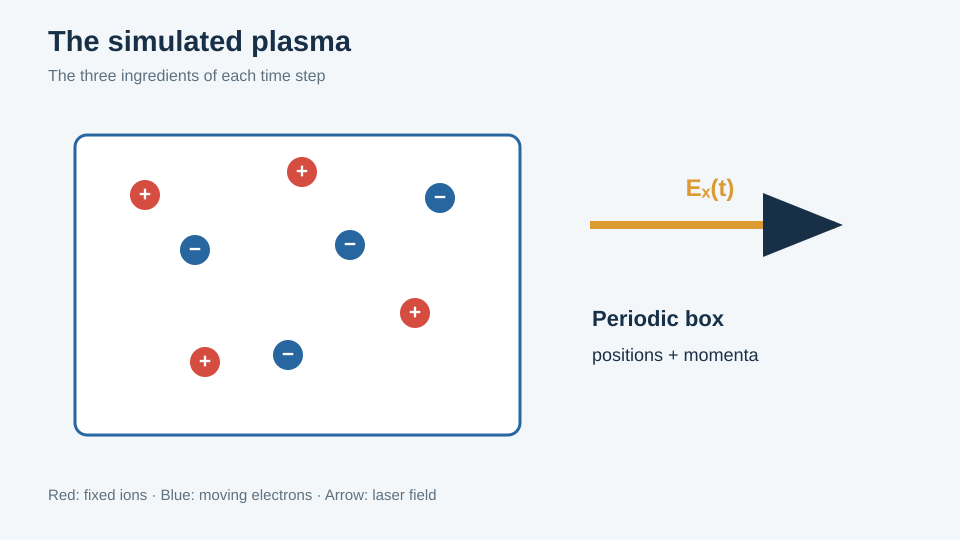

# LaserPlasma.jl

## A molecular-dynamics measurement of collisional absorption

This package computes the collisional absorption (inverse bremsstrahlung) of a laser
field in a fully ionized plasma by direct particle simulation: `N` electrons moving
among `N` fixed ions in a periodic cube, driven by a uniform dipole field
`E_x = F₀cos(ωt)`, with the absorbed energy per laser cycle measured directly and
converted into an effective collision frequency `ν_ei`. It reproduces a C code
written at RWTH Aachen in 1999–2000, and it is validated against that code
digit by digit.

The physics is summarized on one page — [The model as implemented](model.md) — which
states the parameters, conventions and approximations precisely rather than
motivating them. **The weight of this guide is on the computational side**: how the
periodic forces are tabulated, how the tree approximation and the adaptive
individual-step integrator work and interact, how the Julia code is structured, and
how the port is verified. That is [Algorithms](methods.md) and
[Code guide](code-guide.md), and they assume no familiarity with Julia or with
particle-code engineering.

### The interesting computational content

If you want to know in advance whether there is anything here worth your time, these
are the four things this code does that a naive implementation would not:

1. **The periodic Coulomb correction is tabulated once**, on a 17³ grid, holding only
   the Ewald correction with the central `1/r` removed — so the softening lengths can
   change without rebuilding the table.
2. **A Barnes–Hut octree** stored as a structure of arrays with nodes recycled across
   rebuilds, with the multipole order carried as a *type parameter* so that the
   monopole/dipole/quadrupole branches vanish at compile time.
3. **A recursive individual-step integrator**: each electron is tested separately by
   step doubling, those that pass are frozen and interpolated for the rest of the
   interval, and only the failures recurse. In the historical runs it descends twelve
   levels.
4. **The coupling of the two**: the tree topology is frozen within a level, moments
   refreshed per RK4 stage, interaction lists rebuilt per level against the stability
   mask and packed into flat per-thread arenas.

The resulting code is faster than the original C at `-O2` on the same machine, and
bit-comparable to it where it should be.

### Where to go

| Page | Contents |
|---|---|
| [Getting started](getting-started.md) | Julia, the project environment, a first run in a few seconds, and what it writes. Written for someone who does not use Julia. |
| [The model as implemented](model.md) | The simulated system, its parameters, units, initial conditions, diagnostics and output conventions. One page, no motivation. |
| [Algorithms](methods.md) | Ewald tabulation, Barnes–Hut, the adaptive integrator, their coupling, and the performance engineering underneath. |
| [Figure gallery](gallery.md) | The ten result figures of the 2000 study, with the provenance of every curve. |
| [The method in pictures](method-illustrations.md) | The algorithms as a visual walkthrough. |
| [Code guide](code-guide.md) | Julia for a numericist who does not write it, and the design of this package. |
| [Glossary](glossary.md) | Computational vocabulary, and the parameters that are easy to confuse. |

### What the figures are

The *result* plots redraw the archived 2000 output, which ships with the repository —
redrawing one does not rerun a simulation. The dielectric-theory curves and the
potential shapes are recomputed by this port. The *method* diagrams are new, generated
by Julia scripts; they explain the same ideas as the original hand-drawn slides
without being copies of them. Each entry in the [gallery](gallery.md) says which it is.
