# The method in pictures

The 2000 presentation used fifteen explanatory drawings. `figures/diagrams.jl` generates
an English counterpart for each, plus one overview image. They are **new** drawings,
produced by code, explaining the same ideas — not copies of the originals.

```sh
julia --project=. figures/diagrams.jl     # SVGs into figures/out/
```

This page is the visual walkthrough of [Algorithms](methods.md); the last section shows
the same ideas in real numbers. All result plots are in the [gallery](gallery.md).

## Setup and boundaries


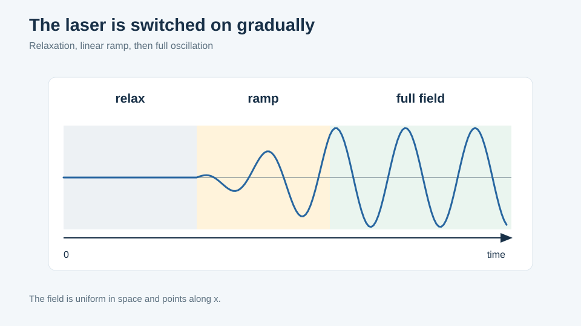

The envelope: `n_relax` periods with the field off, `n_increase` periods of linear
ramp, full amplitude thereafter.

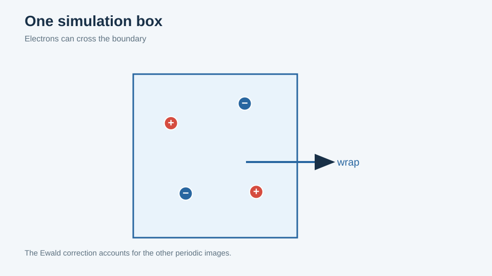

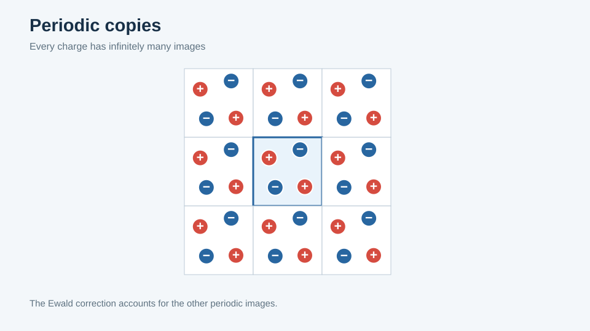

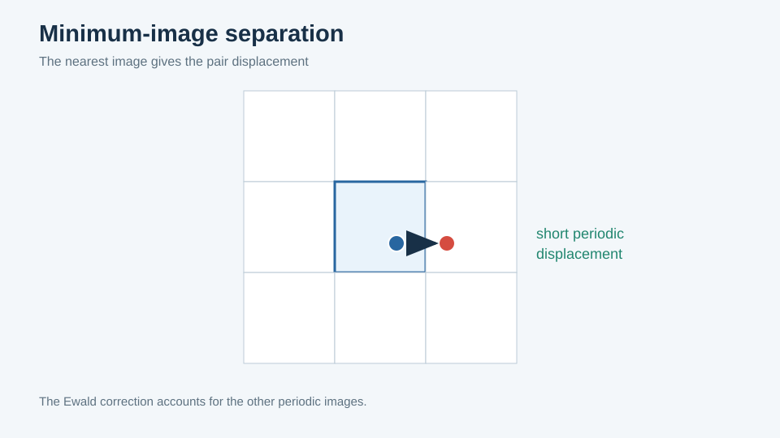

The third of these is the one with a practical consequence: it is why trajectories in
the [gallery](gallery.md) are crossed by long straight segments no particle traversed.

## Ewald


The second drawing shows the split this code's table actually stores: the periodic
potential minus the central term. The `1/r` is supplied separately, which is what keeps
the softening lengths independent of the table.

## Barnes–Hut


Recursive octant subdivision of occupied cells.


The opening test: accept a cell's multipole summary, or open it and repeat on its eight
children. `theta` sets the threshold.

## Individual steps — the problem

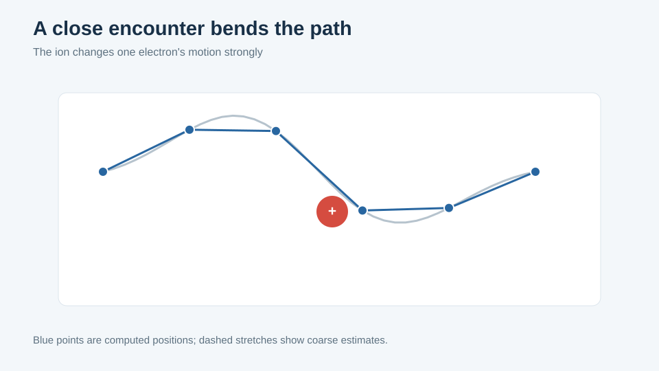


An affordable uniform step cuts the corner of the encounter.

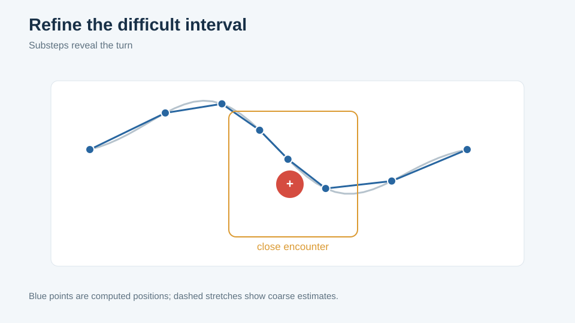

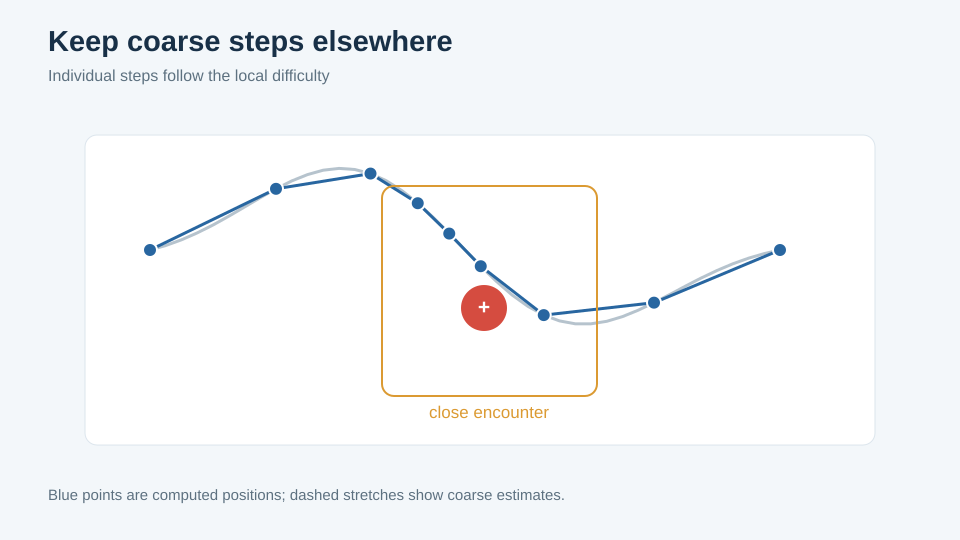

The target distribution of effort: dense through the encounter, sparse elsewhere — which
is almost everywhere, for almost every particle.

## Individual steps — the mechanism

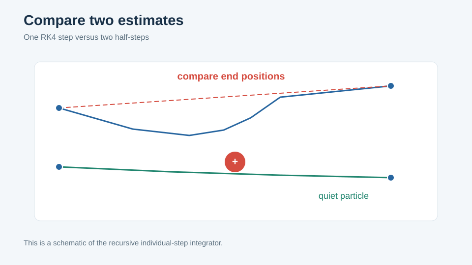

Step doubling: one step of length `h` against two of `h/2`.

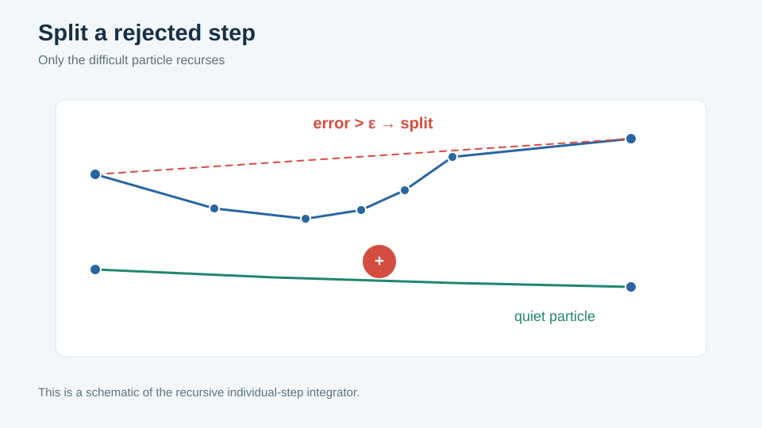

The comparison is made **per particle**. Failures are passed to the two half-intervals
and the procedure recurses.


Particles that pass are frozen for the rest of the interval and supplied to deeper
levels by quadratic interpolation through the three RK4 nodes already computed. This is
where the saving actually comes from: they stop being integrated at all.

## The same thing in real numbers

### `method3d`

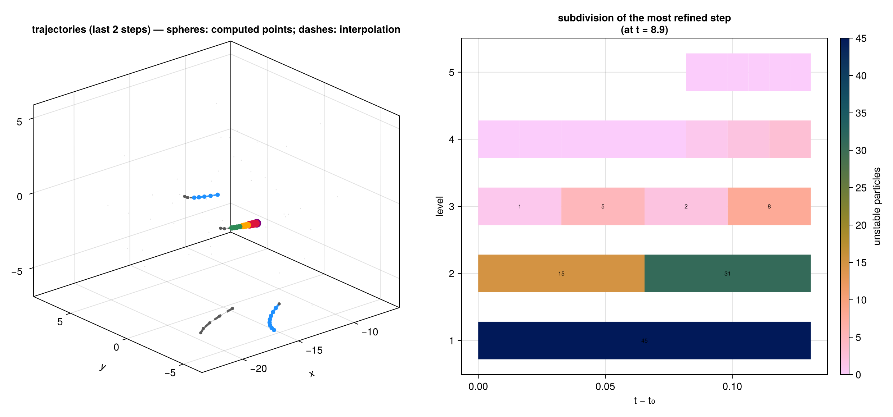

Generated by a short Julia run (`figures/method3d.jl`), and the most direct evidence
that the scheme behaves as described.

**Left:** electron paths over the last two outer steps. Spheres are genuinely *computed*
points; dashes are stretches supplied by interpolation after the particle was frozen.

**Right:** the recursion for one outer step as a timeline. Each band is a level, width is
time across the step, and the number in each block is **how many particles were still
unstable** there. Reading upward: 45 at level 1; 15 and 31 in the two halves at level 2;
1, 5, 2, 8 at level 3; and by level 5 only a sliver of the interval is still
subdividing. That collapse is the algorithm's entire economic case.
[PDF](assets/figures/method3d.pdf)

### `indiv` and `indiv2`

Archived 2000 data, redrawn by `figures/indiv.jl` — not schematics.

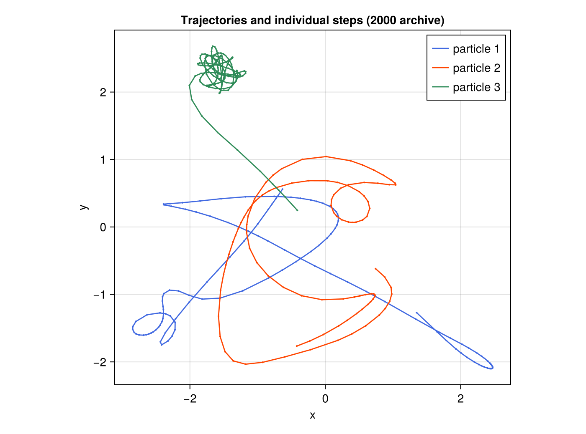

Three electron paths with a dot at every computed point. Along the open sweeps the dots
are widely spaced; in the trapped tangle at the top they are dense enough that the path
reads as solid. [PDF](assets/figures/indiv.pdf)

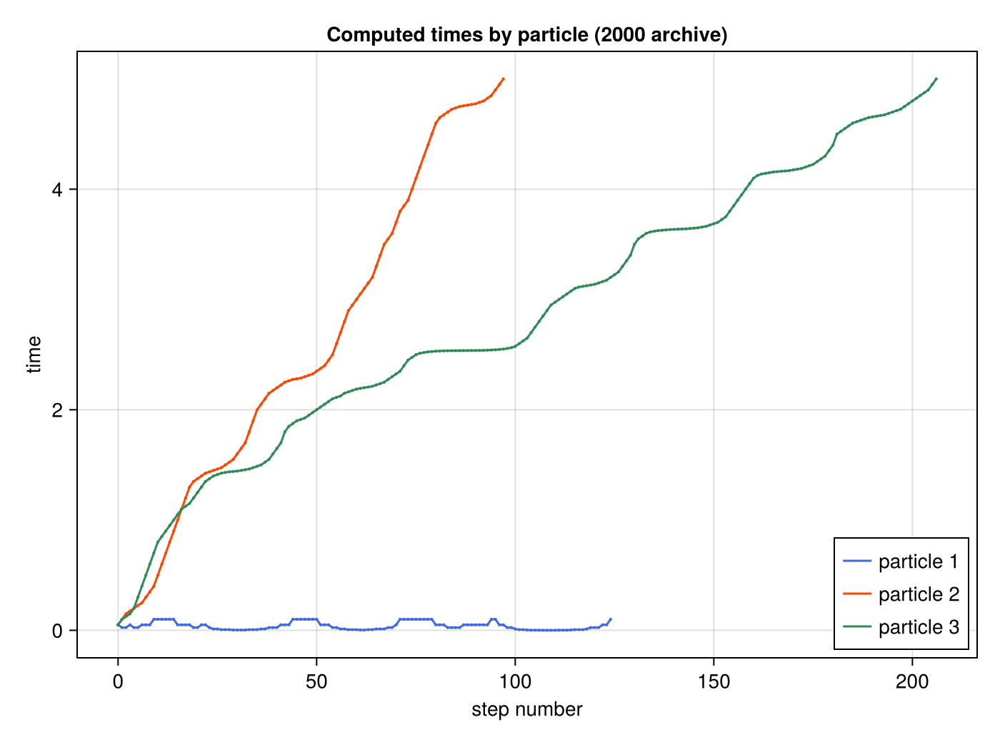

The same fact as accounting, and the most informative plot of the set: computed steps on
the horizontal axis against simulated time reached on the vertical. A particle taking
large steps climbs steeply; one under heavy refinement stays flat. The blue curve spends
about 125 computed steps advancing simulated time by essentially nothing, while other
particles cross the same interval in a handful.
[PDF](assets/figures/indiv2.pdf)
