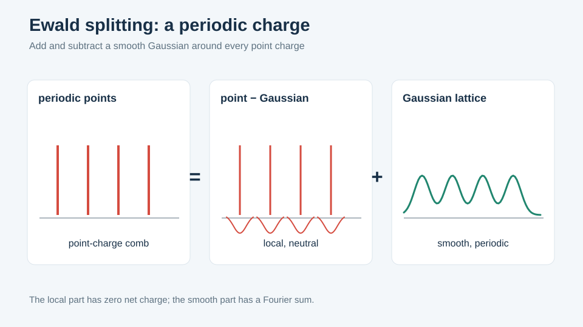
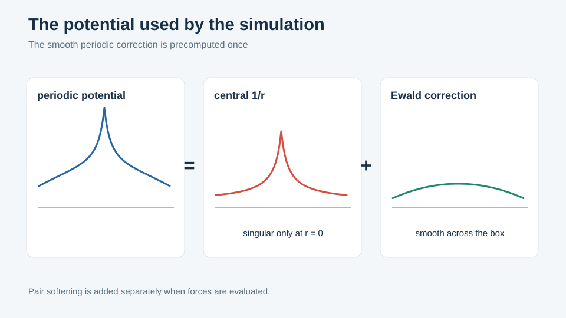
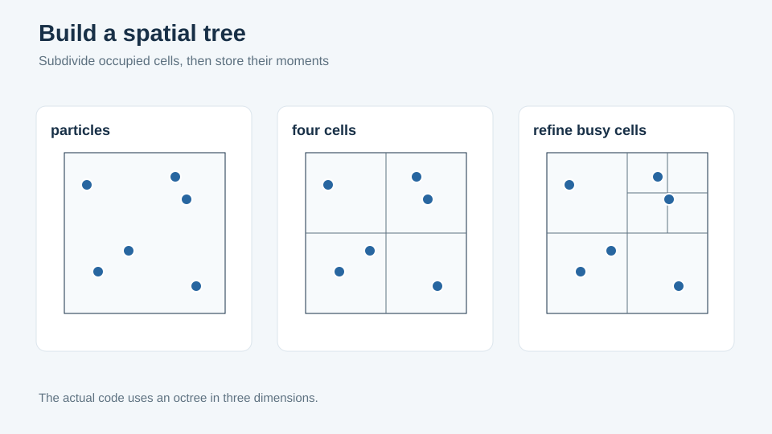
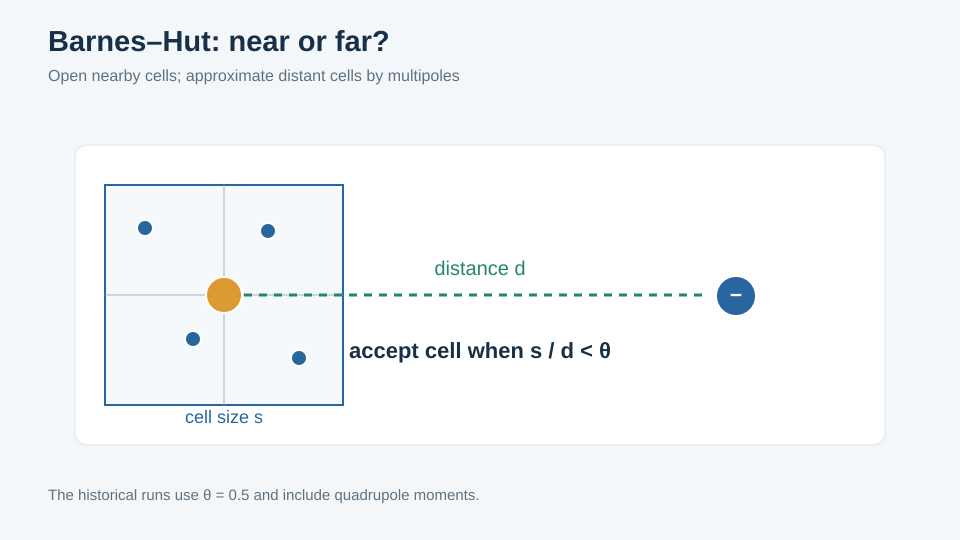
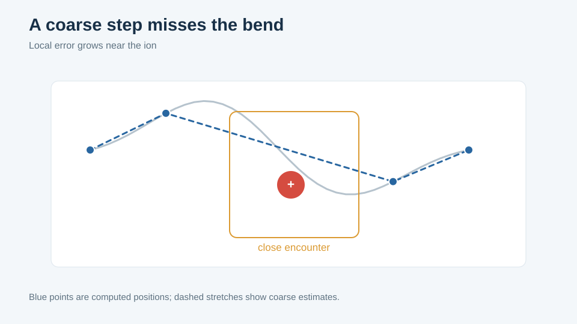
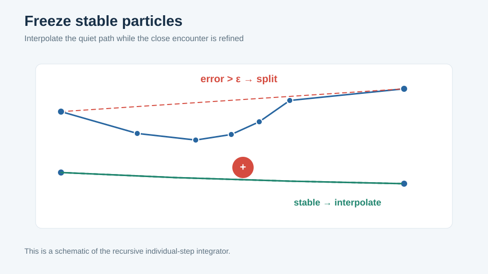

# Algorithms

Four things carry the computational weight of this code: the tabulated Ewald
correction, the Barnes–Hut octree, the recursive individual-step integrator, and the
way the last two are coupled. This page describes each as implemented, then the
engineering that makes the implementation fast, then how the whole is verified.

Nothing here assumes familiarity with particle codes or with Julia. The Julia
mechanics themselves are in the [code guide](code-guide.md).

## 1. The Ewald correction, tabulated

The method needs no introduction; its treatment here does.

The periodic correction — everything beyond the central `1/r` — depends only on the
separation vector within the box, not on which particles are involved, and not on
time. It is therefore a fixed function of three variables, and this code computes it
**once** at startup onto a 17×17×17 grid over the box (`build_ewald_table`,
`src/ewald.jl`), reading it back during the run by trilinear interpolation over the
eight surrounding grid points.

Three consequences worth noting:

- **The `1/r` term is not in the table.** What is stored is `erfc + reciprocal − 1/r`.
  The central term is supplied separately by the softened pair potential, so the
  softening lengths are free parameters that never invalidate the table. Had the
  table been built from the full potential, every change of `r_pot` would have meant
  rebuilding it.
- **Accuracy is fixed at build time, not run time.** The α = 2/L splitting and the
  truncation of both sums at 5 are baked into the table, and the interpolation error
  of the 17³ grid is then a property of the table rather than of the step. In this
  port the table agrees with the reference implementation to ≤ 1.3·10⁻¹⁵.
- **The tree needs more than the value.** With multipoles, the force on a distant
  cell requires the derivatives of the field, so the tree path builds a second,
  larger table (`build_ewald_hessian_table`) carrying the Hessian as well. This is
  why switching `use_tree` changes which table is constructed.

## 2. Barnes–Hut

Direct summation is `O(N²)` per force evaluation: at `N = 2000`, four million pairs,
several times per step, for thousands of steps. Barnes–Hut replaces it with `O(N log N)`
by summarizing distant groups.

**The structure.** Recursively subdivide the box into octants until cells are nearly
empty. Each cell stores its total charge and its multipole moments. To evaluate the
force on one electron, walk from the root; for each cell, compare its size against its
distance, and either accept its multipole summary or open it and repeat on its eight
children. The opening criterion is governed by `theta` — smaller is fussier and more
accurate. The historical runs use `theta = 0.5` with quadrupole moments.

**How it is stored, and why it matters.** The obvious representation is a
`Vector{Node}` of linked objects. This code instead uses a **structure of arrays**:
`pos[:, i]`, `charge[i]`, `quad[:, i]` and so on, with node identity being nothing but
a column index (`src/tree.jl`, `Octree`). Bodies occupy columns `1..nbody`, cells are
appended as construction proceeds, and `0` means "none".

The reason is memory access. A tree walk touches one or two fields of very many nodes.
With an array of node objects, each visit pulls an entire node — position, charge,
dipole, quadrupole, child pointers — into cache to read one field of it, and the nodes
are scattered across the heap. With separate arrays, the walk reads contiguous runs of
exactly the fields it needs. The same reasoning drives the `3 × N` particle layout used
everywhere else in the package.

Nodes are also **recycled across rebuilds** rather than reallocated — the tree is
rebuilt many times per step, and this is the C free list carried over deliberately.

**The multipole order is a type parameter.** `Octree{Q}` carries `Q ∈ {0, 1, 2}`
(monopole, dipole, quadrupole) *in the type*, not in a field. The consequence is that
the branches selecting how much of the multipole expansion to evaluate are resolved
when the code is compiled, not at each of the millions of node visits at run time.
The [code guide](code-guide.md) explains the Julia mechanism; the effect is that the
generality costs nothing.

## 3. Individual time steps

This is the substantive numerical idea, and the one the original work was built
around.

**The problem.** In a Coulomb system the required time step is set by the worst
encounter in the box, and encounters are rare. A uniform step sized for them wastes
essentially all its work on particles that did not need it; a step sized for the
typical particle destroys precisely the close encounters that produce the absorption
being measured.

**The scheme.** Over an outer interval, the integrator performs a standard step
doubling — one RK4 step of length `h`, and two of length `h/2` — but draws a
**per-particle** conclusion from it:

1. Compare the two position estimates for each electron separately, against the
   tolerance `eps`.
2. Electrons that pass are **frozen** for the remainder of this interval: they are
   never integrated again at any deeper level. Where deeper levels need their
   positions — and they do, since the failing electrons feel their forces — those are
   supplied by quadratic Lagrange interpolation through the three RK4 nodes already
   computed (`t`, `t + h/2`, `t + h`).
3. Electrons that fail are passed to the two half-intervals, and the whole procedure
   recurses.

The saving is real rather than notional, because the frozen particles genuinely leave
the computation: they contribute forces from an interpolant, at the cost of three
multiply-adds, while the failing minority recurses. In the historical runs the
recursion reaches **level 12** — a step 4096 times finer than the outer one, for a
handful of particles.

The `method3d` figure in [the method in pictures](method-illustrations.md) shows a real
recursion profile: 45 unstable particles at level 1, 15 and 31 in the two halves at
level 2, then 1, 5, 2, 8 at level 3, with only a sliver of the interval still
subdividing by level 5.

**Attribution.** The scheme — recursive refinement, per-component testing, freezing
and interpolation — is equivalent to the *recursive refinement strategy* of Savcenco,
Hundsdorfer and Verwer, BIT **47** (2007) 137–155, and its coupling to a tree with
frozen interaction lists to McMillan and Aarseth, ApJ **414** (1993) 200. The
1999–2000 code reached it independently; it is not a novel contribution of this
repository, and saying so is more useful than claiming otherwise.

## 4. Coupling the tree to the adaptive integrator

Tree and individual steps do not compose trivially, and the interlock is the most
delicate part of the code. It is expressed as three hooks, dispatched on the force
scheme (`src/schemes.jl`):

| Hook | When | Tree action |
|---|---|---|
| `prepare_step!` | Once per outer step | Build the tree; build the full interaction lists |
| `prepare_stage!` | Once per RK4 stage | Refresh body positions and cell moments, **keeping the topology** |
| `prepare_level!` | On entry to each recursion level | Rebuild the tree and the interaction lists against the current stability mask |

The important invariant is the middle row: **topology is frozen within a level, while
moments are refreshed per stage**. Rebuilding the tree between the stages of a single
RK4 step would make the right-hand side discontinuous in a way the integrator does not
expect; not refreshing the moments would evaluate forces from stale positions. Freezing
the interaction lists is also what makes the frozen-particle optimization pay: a stable
electron has `lens[i] = 0` and its list is never walked at all.

The lists themselves are packed into **flat per-thread arenas** with `starts[i]` and
`lens[i]` delimiting each electron's range, rather than a `Vector{Vector{Int}}`. One
buffer per thread, reused across rebuilds; once the high-water mark is reached the
rebuild allocates nothing.

For direct forces, all three hooks are no-ops — a method defined on `DirectScheme`
that returns `nothing`. Choosing the force method is choosing a type, not setting a
flag.

## 5. Making it fast

Four measured decisions, none of which changes any result.

**Allocation-free recursion.** Every buffer the recursion needs — per-level particle
sets, the RK4 stage arrays, the stability `BitVector` — is allocated once into a
`MultistepWork` at the start of the run and reused. The recursion is the hot spot of
the program, and allocating inside it costs a **measured factor of 190**.

**Compile-time specialization instead of flags.** The C selected behaviour with global
integers (`stepper`, `f_magneto`, `bckgrd_ion`, `do_tree`, `usequad`). Here each is a
type: `DirectScheme`/`TreeScheme{Q}`, `Forces{E,I}`, `SoftCorePot`. The branches
disappear from the inner loops, and adding a variant means adding a method rather than
editing a switch.

**Threading with a work-based threshold.** A population threshold is the wrong
criterion, because the per-particle cost differs by scheme: `O(N)` for direct sums,
`O(log N)` with the tree. The direct path therefore thresholds on the **pair count**,
`par_worth(population, n) = population * n ≥ 4096`, rather than on the number of
particles. Using a population threshold of 512 instead left every `N ≤ 500` benchmark
running on one core out of ten — at `N = 500` every particle is unstable at level 1
and the step is 250 000 pair evaluations, which is emphatically worth splitting.

Note what makes this legal: electron `i` writes only its own columns and sums its own
pairs in the same order, so splitting the loop changes no arithmetic and the direct
path stays bit-identical to the reference.

**A deliberate exception: `PerParticleScheme`.** The default direct path exploits
Newton's third law, computing each pair once and accumulating into both particles.
That halves the arithmetic and cannot be threaded, because two threads would write the
same column. `PerParticleScheme` does the full `N²` instead — twice the arithmetic,
but each particle writes only itself, so it threads, and it sums in the same order as
the adaptive integrator, which makes a paired comparison of the two integrators isolate
the integrator rather than mixing it with the force assembly. It is *not*
bit-identical to the reference `verlet`, and the docstring says so. It exists for
measurement in new regimes, not for reproducing archived runs.

Result: the tree path is faster than the original C compiled at `-O2` on the same
machine — 0.64 against 0.81 s/step at `N = 2000` single-threaded, roughly ×3 on top of
that with threads.

## 6. How any of this is known to be correct

The C program still compiles and runs, which makes it an **oracle** rather than a
historical document. Correctness here means numerical agreement with it, not a
plausible argument.

| Component | Agreement with the reference |
|---|---|
| RNG (`dran2`, `gasdev`, `sobol_`) | bit-identical |
| Ewald table | ≤ 1.3·10⁻¹⁵ |
| Verlet | 2.7·10⁻¹⁵ |
| Barnes–Hut forces | ≤ 3.1·10⁻¹⁵ |
| Individual-step integrator | 5.1·10⁻¹³ |
| Thermostat | 2.3·10⁻⁹ |
| Dielectric theory | ≤ 2 % against archived curves |

The exact reproduction of the random draws is what makes the first six rows possible:
without it, two runs diverge immediately and only statistical comparison remains.

Two working rules are worth repeating because they are easy to get wrong. **Dump the
inputs at the entry of the routine under test, never elsewhere** — a routine called
twice per step, or before and after a transformation of the same array, yields
snapshots of different instants and a comparison that means nothing. And **any
discrepancy is arbitrated, never silently corrected**: a 1999 C program contains
fragilities that compilers of the day tolerated, and a genuine bug in the original is
documented and reproduced rather than quietly fixed.
